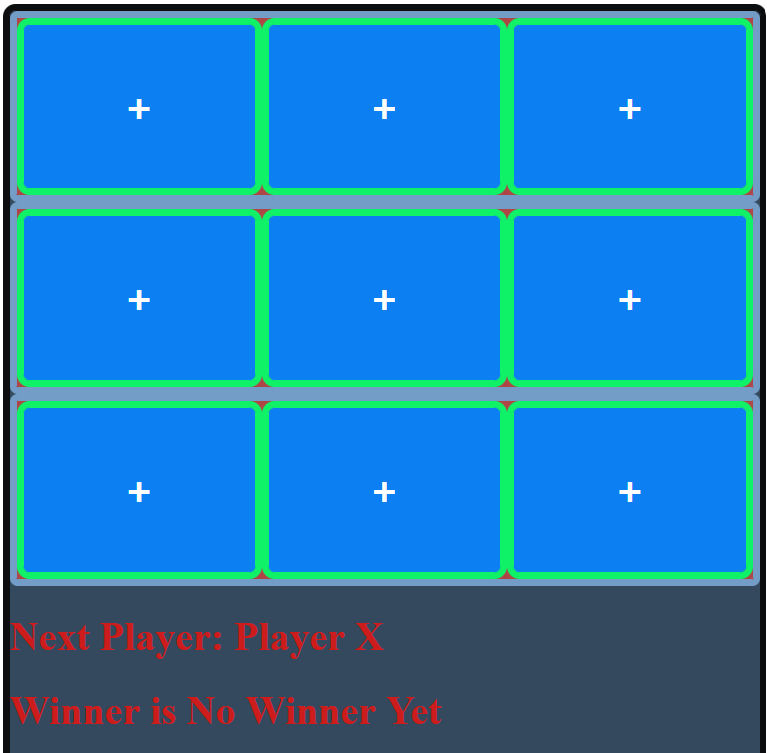

# ATM Machine Exercise

## Description

Simple React tictactoe game application.

## Technologies Used

* _HTML_
* _JavaScript_
* _CSS_

## Installation

* Clone this repository to your local machine.
* Open you command line with the path to the directory to this repository.
* Run npm install http-server and access the page on your browser.

## Roadmap of Future Improvements 

* Make the User play against the computer, adding a function that simulate the computer thinking.

## Contributions 

Pull requests are welcome. For major changes, please open an issue first to discuss what you would like to change.

## License

[MIT](./LICENSE)